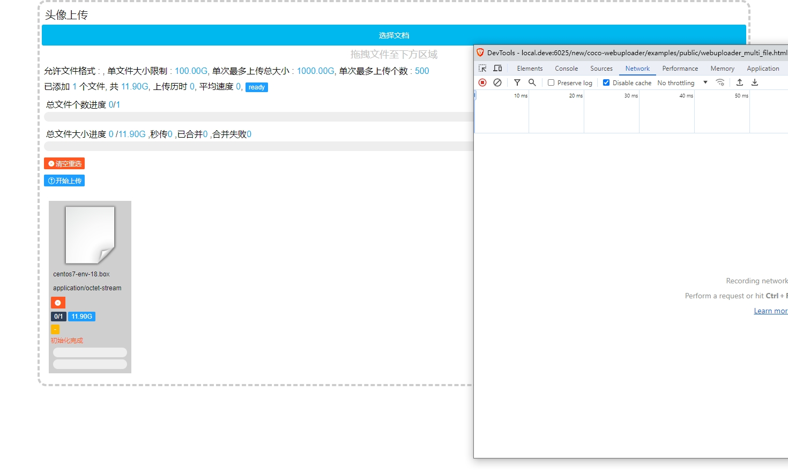
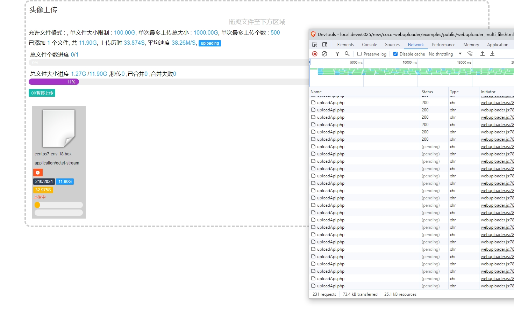
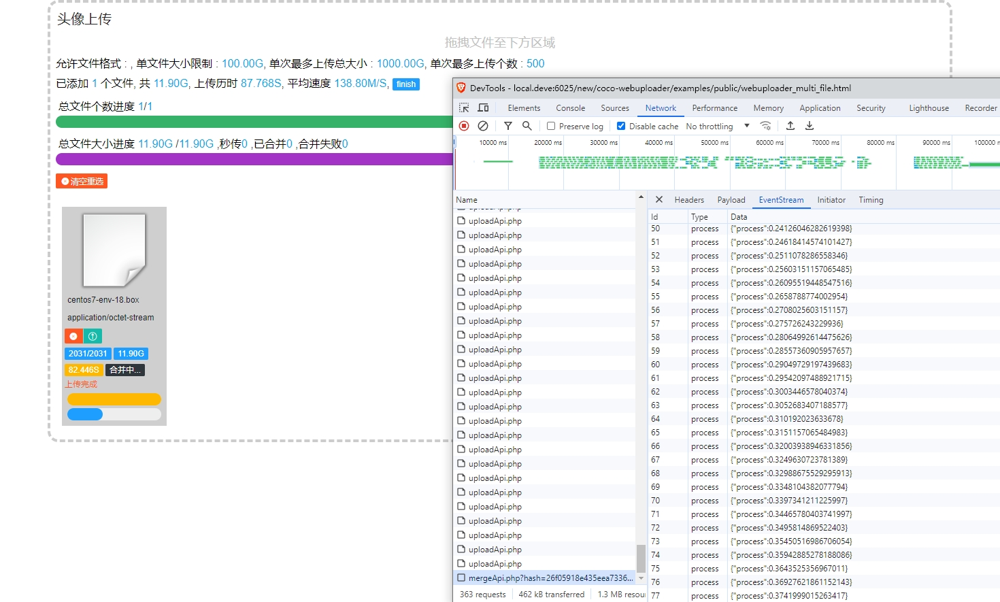
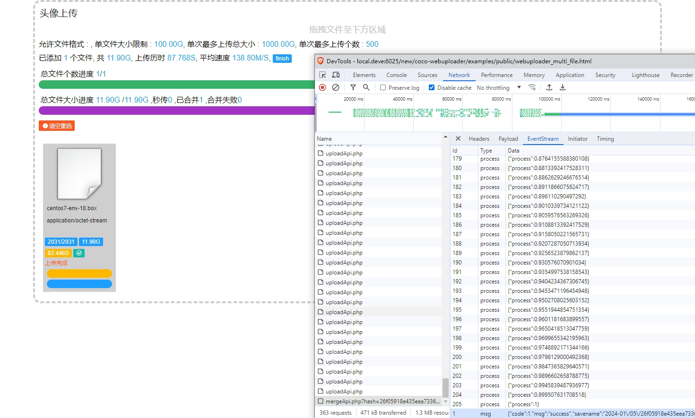
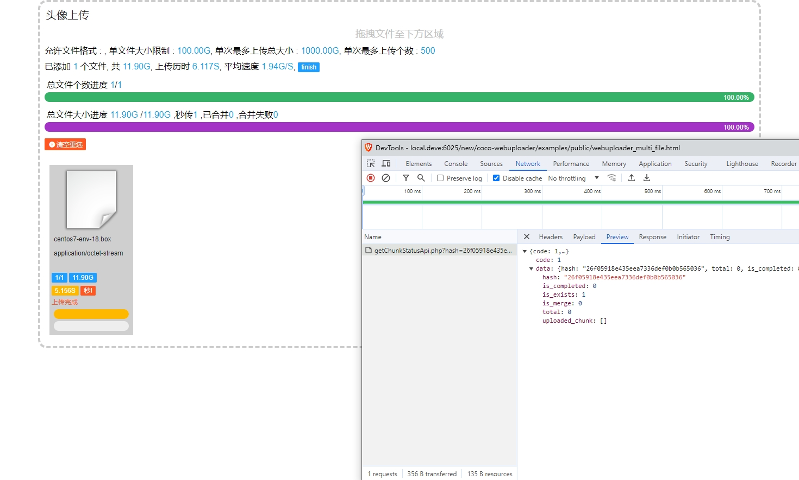

# webuploader

* 为百度的 webuploader 插件编写的服务器端，支持：
    * 分片上传
    * 断点续传（页面刷新，换浏览器，换电脑都可以接着传，只要是同一文件）
    * 秒传（需配合mysql，逻辑已编写完成，直接建表配置即可）
* 服务器端分片上传处理逻辑经过大量测试和优化，支持上传 10G 文件无压力，根据服务器的配置，调节合理的并行上传参数，十分稳定
* 配置 symfony 的事件管理库，可自行配置文件上传成功后的处理事件，对文件做后续处理，压缩，打水印等
* 抽象了上传文件验证器，自定义上传时服务器端的验证规则
* 如果配置数据库，使用秒传功能，建议的是直接将此数据库作为业务中的统一资源管理库，其他任何需要文件资源的地方引用此数据库中的数据，方便管理数据

---

> 客户端和服务器端详细示例参考 examples 文件夹

### 功能介绍

### `examples/uploadApi.php`

* 上传接口，处理分片上传

### `examples/getChunkStatusApi.php`

* 根据当前文件专用算法的hash值，获取当前文件上传的分片状态，即获取哪些分片上传过，上传文件时自动跳过

### `examples/mergeApi.php`

* 所有分片上传完以后，调用此接口合并服务器端文件，此接口通过 js 的 EventSource 调用，可实时看到合并进度

### `examples/clearTempFile.php`

* 成功上传的文件，临时分片文件会自动被删除，但上传中断产生的分片文件会残留在服务器中，此脚本用于清理超过指定时间的临时分片文件
* 建议设定定时任务 30 分钟调用一次，分片残留时间建议设定为 7200 秒
* 客户端需配置自动定时调用此接口，默认设定 30 分钟调用一次

---
### 预览

* 文件加入队列



* 开始上传
* 如果上传一部分后页面被刷新中断，再次上传时会自动跳过已经上传的分片，继续上传



* 上传完成自动合并文件，合并时可实时看到进度，通过 JS 的 EventSource 实现
* 如显示合并失败，缺少分片数据，可点击上方蓝色重传按钮，重新上传缺失的分片
* 重传后会自动重新触发合并



* 合并完成



* 上传过的文件，再次上传时，会提示秒传




---

### 配置


```javascript

(function () {

    //上传ui 容器id ，一个div标签即可
  let containerId       = "#uploader";

  let config = {

      //此处参数都必填
    _extConfig: {
        
        //组件标题
      title            : "头像上传",
    
      //上传文件预览的 icon 位置
      staticBasePath   : "static/images/file_icon/icon_file/",
      
      //每个文件上传完成时会将返回的 savename 写入到一个hidden input 中，此处指定input 的 name 值
      fieldName        : "image[]",
  
      //清除过时临时分片文件api
      clearTempApi     : "../clearTempFile.php",
      
      //获取文件分片状态api
      getChunkStatusApi: "../getChunkStatusApi.php",
  
      //合并分片api
      mergeApi         : "../mergeApi.php"
    },
    
    //上传api
    server :  "../uploadApi.php",
    
    // $_FILES 的键
    fileVal:  "test_images",

    pick: {
      label: "选择文档"
      // class: "my-uploader-button"
      // style: "background-color: #f00;"
    },

    //分片设置，
    chunkRetry: 5,
    
    //建议 chunkSize 4M - 8M
    chunkSize : 6 * 1024 * 1024,

    //threads 参数，根据服务器配置，建议 5-50 之间，过大过小都会导致上传平均速度过慢
    threads   : 30,

    //文件限制配置
    fileNumLimit       : 10,
    fileSingleSizeLimit: 102400 * 1024 * 1024,
    fileSizeLimit      : 1024000 * 1024 * 1024,
    accept   : {
      // title: "Images"
      // extensions: "gif,jpg,jpeg,bmp,png",
      // mimeTypes : "image/*"
    },
    
    //其他配置
    headers: {
      // "x-chunk-size"   : 1024*4,
    },
    timeout  : 15 * 60 * 1000,
    duplicate: true
  };

  new uploaderController(containerId, config).render();

})();

```

---

### hash 计算

* 没有使用文件的 md5 值，因为在客户端计算一个超过 5G 文件 md5 值时间是无法接受的
* 我考虑过获取部分文件的字节加入计算，但是因为需要在客户端和服务器端独立计算 hash 值，客户端和服务器端无法同时获取到参数，遂放弃。
* 肯定有人会认为过于简单，我只能说自行取舍，目前使用没遇到问题，如果有哪位大神能完美解决这个问题，欢迎 pr

计算公式：

```javascript

function createFileIdentifier(originName, fileTotalSize)
{
    return SparkMD5.hash(originName + "" + fileTotalSize);
}

let hash = createFileIdentifier("test.png", 2544562);

```

---

## Installation

You can install the package via composer:

```bash
composer require coco-project/webuploader
```

## Testing

``` bash
composer test
```

## License

---

MIT
